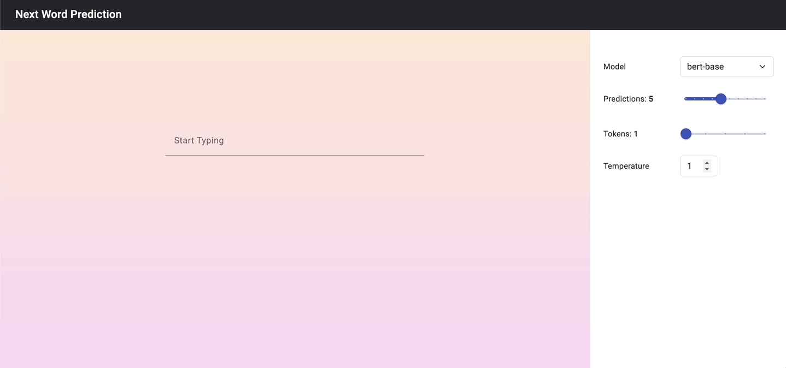

# Next Word Prediction
The "Next Word Prediction" project is a sophisticated text auto-completion system designed to anticipate the following sequence of words as users type. The cutting-edge  [bert-base-uncased](https://huggingface.co/google-bert/bert-base-uncased) model by Hugging Face is used in backend. With applications spanning various fields, from messaging platforms to document creation tools, this project enhances user experience by seamlessly providing predictive suggestions in any textbox.

### Features
-     
    **Flexible model selection:** Users can opt for different models to suit their needs and preferences, ensuring optimal prediction accuracy.
-   **Personalized prediction display:** Adjustable settings empower users to specify the number of predictions shown on their interface, enhancing convenience and usability.
-   **Tailored token prediction:** Users can customize the number of consecutive tokens predicted, enabling fine-tuning of prediction granularity for diverse applications.
-   **Temperature parameter adjustment:** Control over the temperature parameter allows users to balance prediction randomness, providing a balance between creativity and probability in suggested text sequences.
# Getting Started

To get started with Next Word Prediction, follow these steps:

### API Setup

1. Make sure you have Python installed on your system.
2. Create a new conda environment. Install the required dependencies by running the following commands:

```bash
$ conda create -n env <env_name>
$ conda activate <env_name>
$ pip install -r requirements.txt
```
3. Start the API service by running the `app.py` file:
```bash
$ python app.py
```

To enable frontend functionality, a separate service needs to be initiated.GitHub repository for the frontend - [next-word-frontend](https://github.com/Sheel-ui/next-word-frontend).
# Changing env variables and Models

### API

1. You can find a `.env` file in the api directory. Open the file using the following command
```bash
$ vi api/.env
```
2. You can change `HOST`, `PORT` or the `ENDPOINT` of the flask service here.

#### Changing Models
The `.env` file contain variable MODEL that point to the Hugging Face language model bert-base-uncased. By modifying this variable, you can switch to different models.


# Demo


